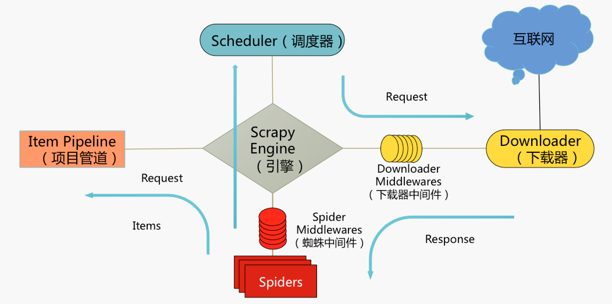

## Scrapy的Request和Response详解

上节课我们学习了中间件，知道了怎么通过中间件执行反反爬策略。本节课主要介绍Scrapy框架的request对象和response对象



通常，Request对象在爬虫程序中生成并传递到系统，直到它们到达下载程序，后者执行请求并返回一个Response对象，该对象返回到发出请求的爬虫程序

Request类和Response类都有一些子类，子类用来添加基类中不必要的功能。这些在下面的请求子类和响应子类中描述

### Request对象

一个Request对象表示一个HTTP请求，它通常是在爬虫中生成，并由下载器执行，从而返回Response

#### 基础参数

- url——请求的url

- callback——请求回来的reseponse处理函数，也叫回调函数

- meta——用来在“页面”之间传递数据
 meta是一个dict，主要用来在解析函数之间传递值
 比如：在parse() 给item某些字段提取了值，并且提取出了一个新的URL，item另外一些字段需要在这个新的URL的response里面提取，为此定义一个parse_item()解析函数用于处理这个response。在用request发送这个新的URL请求的时候，使用parse_item()作为回调函数，并使用meta传递原来已经提取的item字段给parse_item()里的response
 Request对象接受一个meta参数，一个字典对象，同时Response对象有一个meta属性可以取到相应request传过来的meta
 一旦此参数被设置， 通过参数传递的字典将会被浅拷贝

- headers——页面的headers数据

- cookies——设置页面的cookies

#### 基础高级参数

- encoding——请求的转换编码

- priority——链接优先级
 优先级越高，越优先爬取，但不可以序列化
 `序列化 (Serialization)`：将对象的状态信息转换为可以存储或传输的形式的过程。在序列化期间，对象将其当前状态写入到临时或持久性存储区。以后，可以通过从存储区中读取或反序列化对象的状态，重新创建该对象

- dont_filter——强制不过滤
 scrapy会对request的URL去重，加上dont_filter则告诉它这个URL不参与去重

- errback——错误回调
 errback更适合用于检查记录请求产生的错误，但是不适合请求的重试

#### Request对象方法

- copy()：复制一个一模一样的对象

- replace()：对对象参数进行替换

#### Request.meta 一些特殊的keys

- `dont_redirect`：如果 `Request.meta` 包含 `dont_redirect` 键，则该request将会被`RedirectMiddleware`忽略
- `dont_retry`：如果 `Request.meta` 包含 `dont_retry` 键， 该request将会被`RetryMiddleware`忽略
- `handle_httpstatus_list`：`Request.meta` 中的 `handle_httpstatus_list` 键可以用来指定每个request所允许的response code
- `handle_httpstatus_all`：`handle_httpstatus_all`为`True` ，可以允许请求的任何响应代码
- `dont_merge_cookies`：`Request.meta` 中的`dont_merge_cookies`设为`TRUE`，可以避免与现有cookie合并
- `cookiejar`：Scrapy通过使用 `Request.meta`中的`cookiejar` 来支持单spider追踪多cookie session。 默认情况下其使用一个cookie jar(session)，不过可以传递一个标示符来使用多个
- `dont_cache`：可以避免使用`dont_cache`元键等于True缓存每个策略的响应
- `redirect_urls`：通过该中间件的(被重定向的)request的url可以通过 `Request.meta` 的 `redirect_urls` 键找到
- `bindaddress`：用于执行请求的传出IP地址的IP
- `dont_obey_robotstxt`：如果`Request.meta`将`dont_obey_robotstxt`键设置为`True`，则即使启用`ROBOTSTXT_OBEY`，`RobotsTxtMiddleware`也会忽略该请求
- `download_timeout`：下载器在超时之前等待的时间（以秒为单位）
- `download_maxsize`：爬取URL的最大长度
- `download_latency`：自请求已经开始，即通过网络发送的HTTP消息，用于获取响应的时间量
 该元密钥仅在下载响应时才可用。虽然大多数其他元键用于控制Scrapy行为，但是这个应用程序应该是只读的
- `download_fail_on_dataloss`：是否在故障响应失败
- `proxy`：可以将代理每个请求设置为像`http://some_proxy_server:port`这样的值
- `ftp_user` ：用于FTP连接的用户名
- `ftp_password` ：用于FTP连接的密码
- `referrer_policy`：为每个请求设置`referrer_policy`
- `max_retry_times`：用于每个请求的重试次数。初始化时，`max_retry_times`元键比`RETRY_TIMES`设置更高优先级

### Response对象

#### 基础参数

- `url`——请求的url
- `body`——请求回来的html
- `meta`——用来在“页面”之间传递数据
- `headers`——页面的headers数据
- `cookies`——设置页面的cookies
- `Request`——发出这个response的request对象

#### Response对象方法

- `copy()`：同request
- `replace()`：同request
- `urljoin()`：由于将页面相对路径改为绝对路径
- `follow()`：对相对路径进行自动补全

#### urljoin()实例

```Python
import scrapy
class QuotesSpider(scrapy.Spider):
    name = "quotes"
    start_urls = [
        'http://quotes.toscrape.com/page/1/',
    ]
    def parse(self, response):
        #使用css选择器，提取出三个元素的目录的SelectorList
        for quote in response.css('div.quote'):
            yield {
                #使用css选择器，提取出text元素,并把它转换成字符串
                'text': quote.css('span.text::text').extract_first(),
                 #使用css选择器，提取出author元素,并把它转换成字符串
                'author': quote.css('small.author::text').extract_first(),
                 #使用css选择器，提取出tags元素,并把它转换成List
                'tags': quote.css('div.tags a.tag::text').extract(),
            }
            #使用css选择器，提取出href元素,并把它转换成字符串
        next_page = response.css('li.next a::attr(href)').extract_first()#取出相对路径
        if next_page is not None:
            next_page = response.urljoin(next_page)   #页面相对路径改为绝对路径
            yield scrapy.Request(next_page, callback=self.parse)
```

#### follow()实例

```Python
import scrapy
class QuotesSpider(scrapy.Spider):
    name = "quotes"
    start_urls = [
        'http://quotes.toscrape.com/page/1/',
    ]
    def parse(self, response):
        for quote in response.css('div.quote'):
            yield {
                'text': quote.css('span.text::text').extract_first(),
                'author': quote.css('span small::text').extract_first(),
                'tags': quote.css('div.tags a.tag::text').extract(),
            }
        next_page = response.css('li.next a::attr(href)').extract_first()
        if next_page is not None:
            yield response.follow(next_page, callback=self.parse) #返回一个请求实例来跟踪一个链接url
```

### Request、Response实例演示

本节课演示使用的依旧是上节课的58同城（city58）的例子

`city58_test.py`：本例中演示了response的follow函数中相对路径转化为绝对路径，并且比较了request中各个参数的异同

```Python
# -*- coding: utf-8 -*-
import scrapy
from pyquery import PyQuery
from ..items import City58Item

from scrapy.http import Request


class City58TestSpider(scrapy.Spider):
    name = 'city58_test'
    allowed_domains = ['58.com']
    start_urls = ['http://bj.58.com/chuzu/',
                  # 'http://bj.58.com/chuzu/pn2/'
                  ]

    def parse(self, response):
        jpy = PyQuery(response.text)
        li_list = jpy('body > div.mainbox > div.main > div.content > div.listBox > ul > li').items()
        for it in li_list:
            a_tag = it('div.des > h2 > a')
            item = City58Item()
            item['name'] = a_tag.text()
            item['url'] = a_tag.attr('href')
            item['price'] = it('div.listliright > div.money > b').text()

            test_request = response.follow('/chuzu/pn2/', callback=self.parse)   #使用response.follow方法把“/chuzu/pn2/”这个相对路径转换为绝对路径，并回调parse()函数
            test_request2 = Request('http://bj.58.com/chuzu/pn3/',
                                    callback=self.parse,
                                    errback=self.error_back,  #调用异常函数
                                    cookies={},  #cookie设为空
                                    headers={},  #headers设为空
                                    priority=10
                                    )
            test_request3 = Request('http://58.com',
                                    callback=self.parse,
                                    errback=self.error_back,   #调用异常函数
                                    priority=10,   #优先级设为10
                                    meta={'dont_redirect': True}   #不用重定向
                                    )
            test_request4 = Request('http://58.com',
                                    callback=self.parse,
                                    errback=self.error_back,
                                    priority=10,
                                    # meta={'dont_redirect': True}
                                    dont_filter=True  #对url不过滤
                                    )
            yield item
            yield test_request
            yield test_request2
            yield test_request3
            yield test_request4

    def error_back(self, e):
        _ = self
        print(e)  #打印异常信息
```

### 课后作业：实现58同城的翻页以及详情页的爬取

`items.py`：定义要爬取的内容

```Python
import scrapy

class City58Item(scrapy.Item):
    name = scrapy.Field()
    price = scrapy.Field()
    url = scrapy.Field()
    introduce_item = scrapy.Field()
    address = scrapy.Field()
    phone_number = scrapy.Field()
```

`city58_test.py`：实现58同城的翻页以及详情页的爬取

```Python
# -*- coding: utf-8 -*-
import scrapy
from pyquery import PyQuery
from ..items import City58Item

from scrapy.http import Request


class City58TestSpider(scrapy.Spider):
    name = 'city58_test'
    allowed_domains = ['58.com']
    start_urls = ['http://bj.58.com/chuzu/']

    def parse(self, response):
        jpy = PyQuery(response.text)
        li_list = jpy('body > div.mainbox > div.main > div.content > div.listBox > ul > li').items()
        for it in li_list:
            a_tag = it('div.des > h2 > a')
            item = City58Item()
            item['name'] = a_tag.text()
            item['url'] = a_tag.attr('href')
            item['price'] = it('div.listliright > div.money > b').text()

            if item['url']:  #判断url是否为空
                yield Request(item['url'],
                        callback =  self.detail_parse,
                        meta = {'item':item} ,   #使用meta参数，把item传给detail_parse()
                        priority = 10 ,   #优先级设为10
                        dont_filter=True  #强制不过滤)
                        )

        url = jpy('#bottom_ad_li > div.pager > a.next').attr('href')  #提取翻页链接
        test_request = Request(url,
                                callback=self.parse,
                                priority=10,
                                # meta={'dont_redirect': True}
                                dont_filter=True  # 对url不过滤
                                )
        yield test_request   #实现翻页

    def detail_parse(self,response):
        jpy = PyQuery(response.text)
        item = response.meta['item']   #接收item
        item['introduce_item'] = jpy('body > div.main-wrap > div.house-detail-desc > div.main-detail-info.fl > div.house-word-introduce.f16.c_555 > ul > li:nth-child(1) > span.a2').text()   #提取房屋亮点
        item['address'] = jpy('body > div.main-wrap > div.house-basic-info > div.house-basic-right.fr > div.house-basic-desc > div.house-desc-item.fl.c_333 > ul > li:nth-child(6) > span.dz').text()   #房屋详情地址
        item['phone_number'] = jpy('body > div.main-wrap > div.house-basic-info > div.house-basic-right.fr > div.house-fraud-tip > div.house-chat-phone > span').text()   #电话号码
        return item
```

`pipeline.py`：与以前的例子相同，写入文件

```Python
import json

class City58Pipeline(object):

    def open_spider(self,spider):
        self.file = open('58_chuzu.txt', 'w' , encoding='utf8')
        print('打开文件了')

    def process_item(self, item, spider):
        line = '{}\n'.format(json.dumps(dict(item),ensure_ascii = False))
        self.file.write(line)
        return item

    def close_spider(self, spider):
        self.file.close()
        print('关闭文件了')
```

### 补充资料

使用`FormRequest.from_response()`方法模拟用户登录：
`FormRequest`类扩展了基本请求，具有处理HTML表单的功能。它使用`lxml.html`表单从表单数据预先填充表单域从响应对象

除了标准的Request方法之外，FormRequest对象还支持以下类方法：

`classmethod from_response(response[, formname=None, formid=None, formnumber=0, formdata=None, formxpath=None, formcss=None, clickdata=None, dont_click=False, ...])`

返回一个新的`FormRequest`对象，其表单字段值预先填充在给定响应中包含的HTML `<form>`元素中

该policy是默认情况下自动模拟任何可以点击的表单控件，如 `< input type ="submit" >`。即使这是非常方便的，通常是期望的行为，有时它可能会导致难以调试的问题。例如，使用`javascript`填充和/或提交的表单时，默认的`from_response（）`行为可能不是最合适的。要禁用此行为，您可以将`dont_click`参数设置为`True`。另外，如果要更改点击的控件（而不是禁用它），还可以使用`clickdata`参数

```Python
import scrapy

class LoginSpider(scrapy.Spider):
    name = 'example.com'
    start_urls = ['http://www.example.com/users/login.php']

    def parse(self, response):
        return scrapy.FormRequest.from_response(
            response,
            formdata={'username': 'john', 'password': 'secret'},  #预先填好的账号密码
            callback=self.after_login
        )

    def after_login(self, response):
        # check login succeed before going on
        if "authentication failed" in response.body:
            self.logger.error("Login failed")
            return
```
